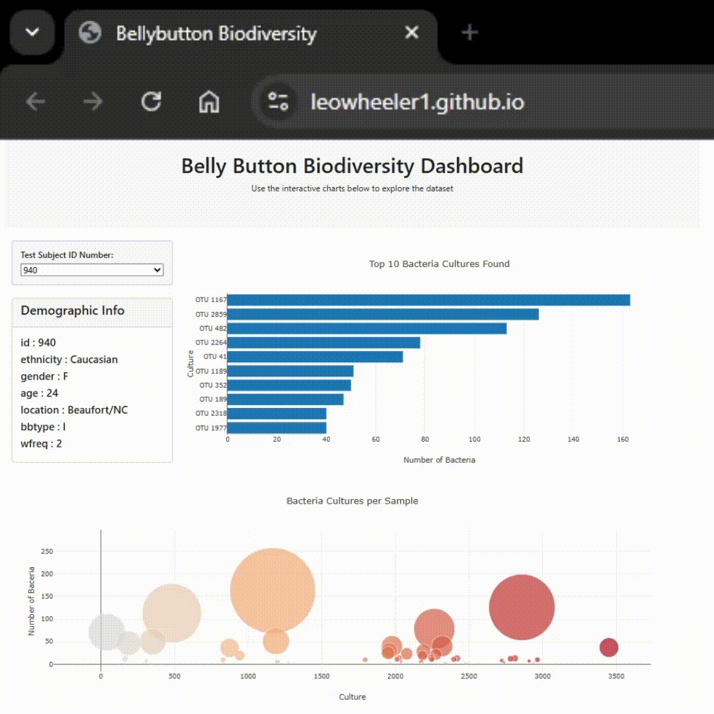

# belly-button-challenge

This challenges uses [data](https://robdunnlab.com/projects/belly-button-biodiversity/results-and-data/) from [The Public Science Lab](https://robdunnlab.com/) at NC State University to explore graphing with Plotly in Javascript and working with HTML files. [The Study]() is focused on ++The dataset reveals that a small handful of microbial species (also called operational taxonomic units, or OTUs, in the study) were present in more than 70% of people, while the rest were relatively rare.

Plots were created using [Plotly-3.0.1](https://github.com/plotly/plotly.js).

## [Dashboard](https://leowheeler1.github.io)

The link above takes the user to the githubPages page for the dashboard of charts, and below is a preview of the page and how it works. 

